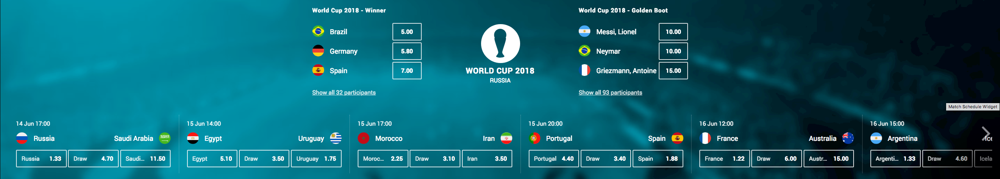

# wc2018-tournament-overview-widget



A widget showing an overview of a tournament though a match schedule of upcoming matches in a scrollable list. The matches shown are based on the tournament (wc2018). The matches are ordered by their start date. The widget also shows two outright betoffers, defaulting to _Winner_ and _Golden Boot_.

In desktop mode the widget has clickable arrows to scroll the widget, In mobile mode the widget instead scrolls normally (by "tap-draging"). In mobile mode the widget has a smaller main logo which will be shown briefly before automatically scrolling it out of sight.

## Configuration

Arguments and default values:

```json
"args": {
    "widgetTrackingName": "wc2018-tournament-overview",
    "filter": "/football/world_cup_2018",
    "iconUrl":
      "https://d1fqgomuxh4f5p.cloudfront.net/tournamentdata/worldcup2018/icons/world_cup_2018.svg",
    "flagBaseUrl":
      "https://d1fqgomuxh4f5p.cloudfront.net/tournamentdata/worldcup2018/icons/",
    "backgroundUrl":
      "https://d1fqgomuxh4f5p.cloudfront.net/tournamentdata/worldcup2018/overview-bw-bg-desktop.jpg",
    "lefttWidgetInput ": {
      "eventId": 1004514530,
      "criterionId": 1001868386,
    },
    "rightWidgetInput ": {
      "eventId": 1002163009,
      "criterionId": 1004240929
    },
}
```

1.  `widgetTrackingName` - String - name for tracking analytics
2.  `filter` - String - url path to tournament
3.  `iconUrl` - String - url path to tournament icon
4.  `flagBaseUrl` - String - url path to participant flags
5.  `backgroundUrl` - String - url path to backgroundUrl. Option to provide custom background image for widget. Otherwise, default background will be used.events
6.  `leftWidgetInput` - object - contains eventId {number} and criterionId {number} for betOffer to display in leftWidget. Option to provide alternative outright betoffer eventId and criterionId. Defults to _Winner_
7.  `rightWidgetInput` - object - contains eventId {number} and criterionId {number} for betOffer to display in rightWidget. Option to provide alternative outright betoffer eventId and criterionId. Defaults to _Golden Boot_

### Build Instructions

Please refer to the [core-library](https://github.com/kambi-sportsbook-widgets/widget-core-library)
